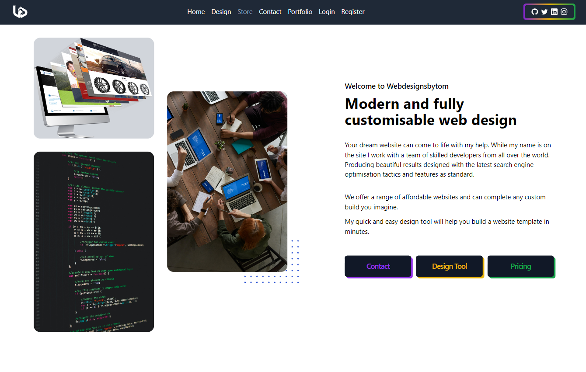

# Webdesignsbytom

A person portfolio and sales website for software development.
Also to trial new components, features and data collection in a live web application.

This app is deployed at [WebDesignsByTom](https://webdesignsbytom.com)

## Table of contents

- [Webdesignsbytom](#webdesignsbytom)
  - [Table of contents](#table-of-contents)
  - [General info](#general-info)
  - [Technologies](#technologies)
  - [Run this project locally](#run-this-project-locally)
  - [Design Information](#design-information)

## General info

A new design for my website as a professional portfolio. Coupled with an attempt to sell freelance work through a sale page.

Server deployment with Vercel @ [https://webdesignsbytom-app.vercel.app/](https://webdesignsbytom-app.vercel.app/)

## Technologies

App developed with:

Frontend: React, JavaScript, Tailwind, Axios, validator

Backend: Express, Prisma, JavaScript, express-handlebars

## Run this project locally

1. Fork this repository and clone the fork to your machine.
2. Navigate to client and server files and run
3. `npm install`
4. `npm start`

## Design Information

1. Link to ERD [ERD...](https://github.com/webdesignsbytom/webdesignsbytom-app/blob/main/assets/ERD-webdesignsbytom.png)
2. Original Design sketches [Sketch](https://github.com/webdesignsbytom/webdesignsbytom-app/tree/main/assets/design-sketches)
